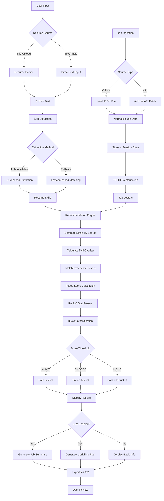

# Job Search & Recommendation System

An intelligent job recommender system that matches candidates to suitable job opportunities using advanced natural language processing, skill extraction, and machine learning techniques. The system provides personalized job recommendations with skill gap analysis and upskilling plans.

## Table of Contents

- [Overview](#overview)
- [Features](#features)
- [System Architecture](#system-architecture)
- [Installation](#installation)
- [Configuration](#configuration)
- [Usage](#usage)
- [Project Structure](#project-structure)
- [Technical Details](#technical-details)
- [Contributing](#contributing)
- [License](#license)

## Overview

The Job Search & Recommendation System is a comprehensive solution for job seekers to discover relevant opportunities based on their resume and skills. The system:

- Ingests job postings from multiple sources (offline JSON files or real-time Adzuna API)
- Parses and extracts information from resumes in various formats (PDF, DOCX, TXT, Markdown)
- Extracts skills using LLM-based or lexicon-based approaches
- Matches candidates to jobs using TF-IDF similarity, skill overlap analysis, and experience matching
- Categorizes recommendations into Safe, Stretch, and Fallback buckets
- Generates personalized upskilling plans using LLM capabilities
- Provides an intuitive web interface built with Streamlit

## Features

### Core Functionality

- **Multi-format Resume Processing**: Supports PDF, DOCX, TXT, and Markdown resume formats with robust text extraction
- **Dual Job Ingestion Methods**: 
  - Offline ingestion from JSON files
  - Real-time job fetching via Adzuna API with country-specific search
- **Intelligent Skill Extraction**: 
  - LLM-based extraction using Ollama or OpenAI
  - Lexicon-based fallback for reliable keyword matching
- **Advanced Job Matching**: 
  - TF-IDF vectorization for semantic similarity
  - Skill overlap analysis
  - Experience level matching
  - Fused scoring algorithm combining multiple signals
- **Smart Recommendation Bucketing**: 
  - Safe matches (score >= 0.70)
  - Stretch opportunities (score 0.45-0.70)
  - Fallback options (score < 0.45)
- **LLM-Powered Insights**: 
  - Automated job summaries
  - Personalized upskilling plans based on skill gaps
- **Data Export**: CSV export functionality for further analysis
- **Interactive Web Interface**: Modern Streamlit-based UI with real-time logging

## System Architecture

### Flow Diagram



### Component Architecture

```
┌─────────────────────────────────────────────────────────────┐
│                    Streamlit Frontend                        │
│  ┌──────────────┐  ┌──────────────┐  ┌──────────────┐      │
│  │ Resume Input │  │ Job Search   │  │ Results View │      │
│  └──────┬───────┘  └──────┬───────┘  └──────┬───────┘      │
└─────────┼──────────────────┼──────────────────┼──────────────┘
          │                  │                  │
          ▼                  ▼                  ▼
┌─────────────────────────────────────────────────────────────┐
│                    Backend Services                          │
│  ┌──────────────┐  ┌──────────────┐  ┌──────────────┐      │
│  │ Resume Parser│  │ Job Loader   │  │ Recommender  │      │
│  └──────┬───────┘  └──────┬───────┘  └──────┬───────┘      │
│         │                  │                  │              │
│  ┌──────▼───────┐  ┌──────▼───────┐  ┌──────▼───────┐      │
│  │Skill Extractor│  │Adzuna API   │  │TF-IDF Engine │      │
│  └──────┬───────┘  └──────┬───────┘  └──────┬───────┘      │
│         │                  │                  │              │
│  ┌──────▼───────┐  ┌──────▼───────┐  ┌──────▼───────┐      │
│  │LLM Service   │  │Chroma DB     │  │Ranking Logic │      │
│  └──────────────┘  └──────────────┘  └──────────────┘      │
└─────────────────────────────────────────────────────────────┘
```

## Installation

### Prerequisites

- Python 3.8 or higher
- pip package manager
- (Optional) Ollama installed locally for LLM features
- (Optional) Adzuna API credentials for real-time job search

### Step-by-Step Installation

1. **Clone the repository**:
   ```bash
   git clone https://github.com/dhinakaran311/Job_Search.git
   cd Job_Search
   ```

2. **Create a virtual environment** (recommended):
   ```bash
   python -m venv env
   source env/bin/activate  # On Windows: env\Scripts\activate
   ```

3. **Install dependencies**:
   ```bash
   pip install -r requirements.txt
   ```

4. **Set up environment variables** (optional):
   Create a `.env` file in the project root:
   ```env
   ADZUNA_APP_ID=your_adzuna_app_id
   ADZUNA_APP_KEY=your_adzuna_app_key
   OPENAI_API_KEY=your_openai_key  # Optional, for OpenAI LLM
   USE_LLM_FOR_SKILLS=1  # Set to 0 to disable LLM-based skill extraction
   ```

5. **Verify installation**:
   ```bash
   streamlit --version
   python -c "import chromadb; print('ChromaDB installed successfully')"
   ```

## Configuration

### Environment Variables

| Variable | Description | Required | Default |
|----------|-------------|----------|---------|
| `ADZUNA_APP_ID` | Adzuna API application ID | No | - |
| `ADZUNA_APP_KEY` | Adzuna API application key | No | - |
| `OPENAI_API_KEY` | OpenAI API key for LLM features | No | - |
| `USE_LLM_FOR_SKILLS` | Enable LLM-based skill extraction | No | 1 |

### Ollama Setup (Optional)

For local LLM capabilities, install and run Ollama:

```bash
# Install Ollama (visit https://ollama.com for platform-specific instructions)
# Pull a model
ollama pull llama2
# Or use other models like mistral, codellama, etc.
```

The system will automatically use Ollama if available, falling back to lexicon-based extraction if not.

## Usage

### Starting the Application

1. **Launch the Streamlit app**:
   ```bash
   streamlit run app_streamlit/app.py
   ```

2. **Access the interface**:
   Open your browser to the URL shown in the terminal (typically `http://localhost:8501`)

### Workflow

#### Step 1: Ingest Jobs

**Option A - Offline Jobs**:
- Click "Ingest offline jobs" in the sidebar
- System loads jobs from `data/sample_jobs.json`

**Option B - Adzuna API**:
- Enter search parameters in the sidebar:
  - Search term (e.g., "python developer")
  - Location (e.g., "india")
  - Country code (e.g., "in")
  - Results per page and pages per query
- Click "Fetch Adzuna Jobs"

**Option C - Interactive Search**:
- Use the "Job Search" section in the sidebar
- Enter job title/keywords and location
- Select country from dropdown
- Click "Search Jobs"

#### Step 2: Input Resume

- **Upload a file**: Use the file uploader for PDF, DOCX, TXT, or MD files
- **Or paste text**: Enter resume content directly in the text area
- **Specify target role**: Enter your desired job role (e.g., "Software Developer")

#### Step 3: Get Recommendations

- Click "Recommend Jobs" button
- System will:
  1. Extract skills from your resume
  2. Fetch relevant jobs from Adzuna (if enabled)
  3. Compute similarity scores
  4. Rank and bucket results

#### Step 4: Review Results

Results are organized into three tabs:

- **Safe**: High-confidence matches (score >= 0.70)
- **Stretch**: Moderate matches requiring some skill development (score 0.45-0.70)
- **Fallback**: Lower matches but still relevant (score < 0.45)

Each result shows:
- Job title, company, location
- Similarity score and skill breakdown
- Matched skills, missing skills
- LLM-generated summary (if enabled)
- Personalized upskilling plan (if enabled)
- Direct link to job posting

#### Step 5: Export Data

- Click "Export CSV" to download recommendations for offline analysis

### Advanced Features

#### LLM-Powered Insights

Enable LLM features in the sidebar:
- Check "Use LLM for skills/summaries"
- System will generate:
  - One-line job summaries
  - Personalized upskilling plans based on skill gaps

#### Skill-Based Job Fetching

When you click "Recommend Jobs", the system:
1. Extracts top 5 skills from your resume
2. Uses these skills as search terms for Adzuna
3. Fetches relevant jobs automatically
4. Computes recommendations based on the fetched jobs

## Project Structure

```
Job_Search/
├── app_streamlit/
│   ├── __init__.py
│   ├── app.py                 # Main Streamlit application
│   └── data/                  # Application data cache
│       ├── adzuna_cache.json
│       └── cache/             # Pickle cache files
│
├── backend/
│   ├── __init__.py
│   ├── config.py              # Configuration settings
│   │
│   ├── db/
│   │   ├── __init__.py
│   │   └── chroma.py          # ChromaDB integration
│   │
│   ├── ingestion/
│   │   ├── __init__.py
│   │   ├── job_api_adzuna.py  # Adzuna API client
│   │   ├── job_loader.py      # Offline job loading
│   │   └── resume_parser.py   # Resume text extraction
│   │
│   ├── services/
│   │   ├── __init__.py
│   │   ├── embedding.py       # Text embedding service
│   │   ├── llm.py             # LLM integration (Ollama/OpenAI)
│   │   ├── ranking.py         # Ranking and bucketing logic
│   │   ├── retrieval.py       # TF-IDF recommender
│   │   └── skill_extractor.py # Skill extraction service
│   │
│   └── utils/
│       ├── __init__.py
│       └── helpers.py         # Utility functions
│
├── chroma_db/                 # ChromaDB data directory
│
├── data/
│   ├── adzuna_cache.json      # Cached Adzuna responses
│   ├── sample_jobs.json       # Sample job data
│   ├── cache/                 # General cache files
│   └── resumes/               # Sample resumes (if any)
│
├── scripts/
│   ├── check_device.py        # Device verification
│   └── verify_phase6.py       # Phase verification
│
├── tests/                     # Test suite
│   ├── __init__.py
│   ├── test_adzuna_api.py
│   ├── test_api_endpoints.py
│   ├── test_recommendation.py
│   ├── test_resume_parser.py
│   └── test_skill_extractor.py
│
├── .gitignore
├── pytest.ini                 # Pytest configuration
├── requirements.txt           # Python dependencies
├── PROJECT_STRUCTURE.md       # Detailed structure documentation
└── README.md                  # This file
```

## Technical Details

### Recommendation Algorithm

The system uses a multi-factor scoring approach:

1. **TF-IDF Similarity (50% weight)**:
   - Vectorizes resume and job descriptions
   - Computes cosine similarity using linear kernel
   - Captures semantic relevance

2. **Skill Overlap (30% weight)**:
   - Extracts skills from both resume and job descriptions
   - Calculates Jaccard similarity: `matched_skills / total_job_skills`
   - Identifies skill gaps

3. **Experience Matching (20% weight)**:
   - Compares candidate experience with job requirements
   - Normalized score: `min(candidate_exp / job_exp, 1.0)`

**Final Score**: `0.5 × similarity + 0.3 × skill_score + 0.2 × experience_score`

### Skill Extraction

**LLM-based (Primary)**:
- Uses Ollama (local) or OpenAI API
- Extracts skills from natural language descriptions
- Handles context and synonyms

**Lexicon-based (Fallback)**:
- Predefined skill dictionary (50+ technical skills)
- Multi-word phrase matching (greedy algorithm)
- Case-insensitive matching with word boundaries

### Job Bucketing

Results are categorized based on final scores:

- **Safe** (score >= 0.70): Strong match, high confidence
- **Stretch** (0.45 <= score < 0.70): Good match, requires skill development
- **Fallback** (score < 0.45): Relevant but lower confidence

### Data Flow

1. **Job Ingestion**:
   - Normalizes job data from various sources
   - Extracts and stores skills
   - Creates TF-IDF vectors for all job descriptions

2. **Resume Processing**:
   - Parses resume file or text
   - Extracts skills using LLM or lexicon
   - Creates resume vector

3. **Matching**:
   - Computes similarity between resume and all jobs
   - Calculates skill overlap
   - Matches experience levels
   - Generates fused scores

4. **Ranking & Presentation**:
   - Sorts by score (descending)
   - Buckets into categories
   - Generates LLM summaries (if enabled)
   - Exports to CSV

### Performance Optimizations

- **Caching**: Resume parsing results cached to avoid re-processing
- **Batch Processing**: Embeddings computed in batches for efficiency
- **Session State**: Jobs and vectors stored in Streamlit session state
- **Parallel Processing**: PDF parsing uses thread pools for multi-page documents

## Contributing

Contributions are welcome and appreciated. Please follow these guidelines:

### Contribution Process

1. **Fork the repository**
2. **Create a feature branch**: `git checkout -b feature/your-feature-name`
3. **Make your changes**:
   - Follow existing code style
   - Add tests for new functionality
   - Update documentation as needed
4. **Test your changes**: Run `pytest` to ensure all tests pass
5. **Commit your changes**: Use clear, descriptive commit messages
6. **Push to your fork**: `git push origin feature/your-feature-name`
7. **Create a Pull Request**: Provide a clear description of changes

### Code Style

- Follow PEP 8 Python style guide
- Use type hints where appropriate
- Add docstrings to functions and classes
- Keep functions focused and modular

### Testing

Run the test suite:
```bash
pytest tests/
```

For coverage report:
```bash
pytest --cov=backend tests/
```

## License

This project is open source. Please refer to the repository for license information.

## Acknowledgements

- [Streamlit](https://streamlit.io/) - Web application framework
- [Adzuna API](https://developer.adzuna.com/) - Job search API
- [ChromaDB](https://www.trychroma.com/) - Vector database
- [scikit-learn](https://scikit-learn.org/) - Machine learning library
- [Ollama](https://ollama.com/) - Local LLM runtime
- [OpenAI](https://openai.com/) - LLM API provider
- [sentence-transformers](https://www.sbert.net/) - Embedding models

## Support

For issues, questions, or contributions, please open an issue on the GitHub repository.